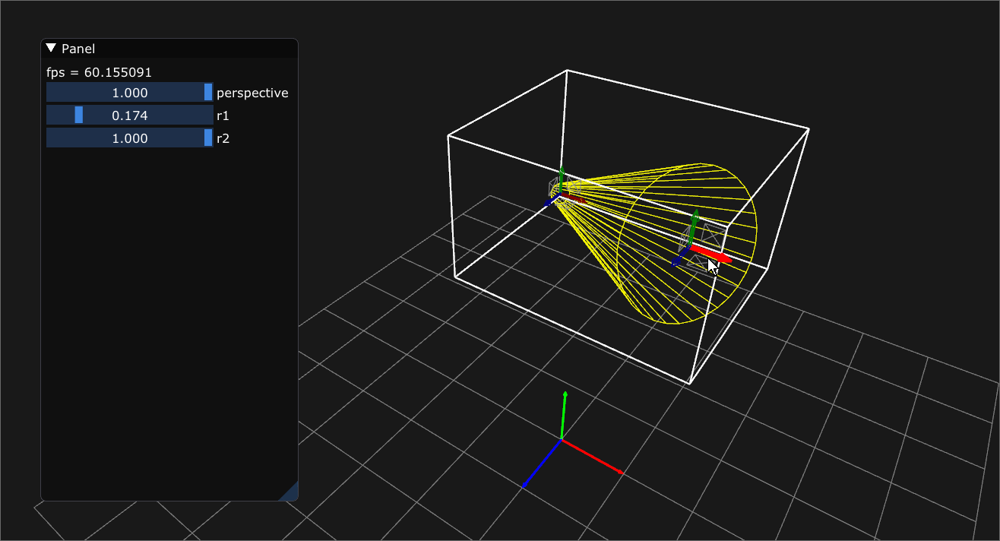
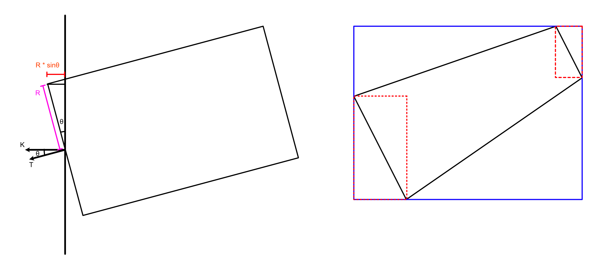
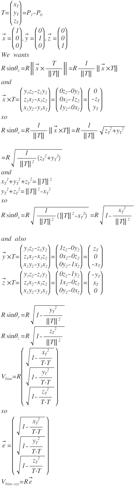

## Cone TightFit AABB

Thanks 
http://iquilezles.org/www/articles/diskbbox/diskbbox.htm

```

git submodule update --init
premake5 vs2019

```

## demo




<!-- 

T=\begin{pmatrix} x_{ T } \\ y_{ T } \\ z_{ T } \end{pmatrix}=P_{ 1 }-P_{ 0 }\\ \overrightarrow { x } =\begin{pmatrix} 1 \\ 0 \\ 0 \end{pmatrix},\overrightarrow { y } =\begin{pmatrix} 0 \\ 1 \\ 0 \end{pmatrix},\overrightarrow { z } =\begin{pmatrix} 0 \\ 0 \\ 1 \end{pmatrix}\\ We\quad wants\\ R\sin { \theta _{ x } } =R\left\| \overrightarrow { x } \times \frac { T }{ \left\| T \right\|  }  \right\| =R\frac { 1 }{ \left\| T \right\|  } \left\| \overrightarrow { x } \times T \right\| \\ and\\ \overrightarrow { x } \times T=\begin{pmatrix} y_{ 1 }z_{ 2 }-z_{ 1 }y_{ 2 } \\ z_{ 1 }x_{ 2 }-x_{ 1 }z_{ 2 } \\ x_{ 1 }y_{ 2 }-y_{ 1 }x_{ 2 } \end{pmatrix}=\begin{pmatrix} 0z_{ 2 }-0y_{ 2 } \\ 0x_{ 2 }-1z_{ 2 } \\ 1y_{ 2 }-0x_{ 2 } \end{pmatrix}=\begin{pmatrix} 0 \\ -z_{ T } \\ y_{ T } \end{pmatrix}\\ so\\ R\sin { \theta _{ x } } =R\frac { 1 }{ \left\| T \right\|  } \left\| \overrightarrow { x } \times T \right\| =R\frac { 1 }{ \left\| T \right\|  } \sqrt { { z_{ T } }^{ 2 }+{ y_{ T } }^{ 2 } } \\ \\ =R\sqrt { \frac { 1 }{ { \left\| T \right\|  }^{ 2 } } \left( { z_{ T } }^{ 2 }+{ y_{ T } }^{ 2 } \right)  } \\ and\\ { x_{ T } }^{ 2 }+{ y_{ T } }^{ 2 }+{ z_{ T } }^{ 2 }={ \left\| T \right\|  }^{ 2 }\\ { y_{ T } }^{ 2 }+{ z_{ T } }^{ 2 }={ \left\| T \right\|  }^{ 2 }-{ x_{ T } }^{ 2 }\\ so\\ R\sin { \theta _{ x } } =R\sqrt { \frac { 1 }{ { \left\| T \right\|  }^{ 2 } } \left( { \left\| T \right\|  }^{ 2 }-{ x_{ T } }^{ 2 } \right)  } =R\sqrt { 1-\frac { { x_{ T } }^{ 2 } }{ { \left\| T \right\|  }^{ 2 } }  } \\ \\ and\quad also\\ \overrightarrow { y } \times T=\begin{pmatrix} y_{ 1 }z_{ 2 }-z_{ 1 }y_{ 2 } \\ z_{ 1 }x_{ 2 }-x_{ 1 }z_{ 2 } \\ x_{ 1 }y_{ 2 }-y_{ 1 }x_{ 2 } \end{pmatrix}=\begin{pmatrix} 1z_{ 2 }-0y_{ 2 } \\ 0x_{ 2 }-0z_{ 2 } \\ 0y_{ 2 }-1x_{ 2 } \end{pmatrix}=\begin{pmatrix} z_{ T } \\ 0 \\ -x_{ T } \end{pmatrix}\\ \overrightarrow { z } \times T=\begin{pmatrix} y_{ 1 }z_{ 2 }-z_{ 1 }y_{ 2 } \\ z_{ 1 }x_{ 2 }-x_{ 1 }z_{ 2 } \\ x_{ 1 }y_{ 2 }-y_{ 1 }x_{ 2 } \end{pmatrix}=\begin{pmatrix} 0z_{ 2 }-1y_{ 2 } \\ 1x_{ 2 }-0z_{ 2 } \\ 0y_{ 2 }-0x_{ 2 } \end{pmatrix}=\begin{pmatrix} -y_{ T } \\ x_{ T } \\ 0 \end{pmatrix}\\ \\ R\sin { \theta _{ y } } =R\sqrt { 1-\frac { { y_{ T } }^{ 2 } }{ { \left\| T \right\|  }^{ 2 } }  } \\ R\sin { \theta _{ z } } =R\sqrt { 1-\frac { { z_{ T } }^{ 2 } }{ { \left\| T \right\|  }^{ 2 } }  } \\ V_{ bias }=R\begin{pmatrix} \sqrt { 1-\frac { { x_{ T } }^{ 2 } }{ T\cdot T }  }  \\ \sqrt { 1-\frac { { y_{ T } }^{ 2 } }{ T\cdot T }  }  \\ \sqrt { 1-\frac { { z_{ T } }^{ 2 } }{ T\cdot T }  }  \end{pmatrix}\\ so\\ \overrightarrow { e } =\begin{pmatrix} \sqrt { 1-\frac { { x_{ T } }^{ 2 } }{ T\cdot T }  }  \\ \sqrt { 1-\frac { { y_{ T } }^{ 2 } }{ T\cdot T }  }  \\ \sqrt { 1-\frac { { z_{ T } }^{ 2 } }{ T\cdot T }  }  \end{pmatrix}\\ V_{ bias-xyz }=R\overrightarrow { e } \\ 

 -->


